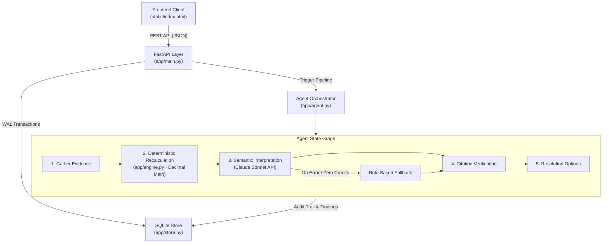

# Dispute Desk — Billing Dispute Investigation & Resolution Agent

[](https://www.python.org/)
[](https://fastapi.tiangolo.com)
[]()
[-success.svg)]()
[](./DESIGN.md)

Autonomous billing dispute investigation agent with **deterministic recalculation**, **grounded AI interpretation**, and **human-in-the-loop settlement approval**.

All mathematical computations and monetary ledgers execute in pure Python using fixed-point `Decimal` arithmetic — zero floating-point discrepancies. An LLM (Claude Sonnet) is strictly confined to semantic interpretation and contextual narrative; every finding must cite verified evidence IDs or it is deterministically discarded.

---

## Quick Start

### 1. Local Environment
```bash
# Clone and enter environment
git clone https://github.com/manishpatel00/dispute-desk.git
cd dispute-desk

# Set up virtual environment
python3 -m venv .venv
source .venv/bin/activate  # Windows: .venv\Scripts\activate

# Install dependencies
pip install -r requirements.txt
pip install -r requirements-dev.txt

# Configure environment
cp .env.example .env       # Optional: add ANTHROPIC_API_KEY for Claude interpretation

# Launch development server
uvicorn app.main:app --port 8000
```
Open **[http://localhost:8000](http://localhost:8000)** in your browser and click **"LOAD SAMPLE CASE"** to begin.

### 2. Docker Deployment
```bash
docker build -t dispute-desk .
docker run -p 8000:8000 -e ANTHROPIC_API_KEY="your-key-here" -v "$PWD/data:/data" dispute-desk
```

---

## Architecture & System Design

The system enforces strict boundary separation between **deterministic computation** and **generative interpretation**:



### Core Invariants

1. **Zero LLM Arithmetic**: LLMs never calculate totals, discount percentages, or credit caps. All numbers originate from `app/engine.py`.
2. **Citation Grounding**: Every finding must reference concrete line IDs, rule IDs, and usage event IDs. Ungrounded assertions are automatically purged during the `verify` stage.
3. **Idempotent Settlement**: Repeated disbursement attempts with the same token are safely recognized and deduplicated; credits exceeding recalculation overbilling are rejected.
4. **Staleness Tracking**: When new evidence (version N+1) is introduced, prior calculations and conclusions are flagged as `stale` until re-investigated.
5. **Design System**: Fully documented in [`DESIGN.md`](./DESIGN.md) following the **Together AI / VoltAgent** specification (near-black `#010120` hero, 3-stop gradient ribbon `#fc4c02` → `#ef2cc1` → `#bdbbff`, crisp white canvas, and canonical 4px radius).

---

## Verification & Test Suite

The codebase achieves **99% line coverage** across 115 tests, validated through automated unit, property-based, and mutation testing.

```bash
# Run complete test suite with coverage
pytest -q --cov=app

# Run adversarial mutation tests (29 injected faults)
python scripts/mutation_check.py

# Run live integration smoke test
python scripts/smoke.py http://localhost:8000
```

### Quality Assurance Layers

| Testing Dimension | Scope & Methodology | Verification File |
|---|---|---|
| **Requirement Traceability** | Validates all functional acceptance criteria outlined in the dispute brief. | [`tests/test_requirements.py`](./tests/test_requirements.py) |
| **Property-Based Testing** | Hypothesis generates arbitrary evidence permutations to verify invariants (conservation of money, commutativity of events, monotonicity of caps). | [`tests/test_properties.py`](./tests/test_properties.py) |
| **Adversarial Fuzzing** | Injects malformed JSON, out-of-bounds numbers, null arrays, and malformed UTF-8 payloads to guarantee zero 500 crashes. | [`tests/test_advanced.py`](./tests/test_advanced.py) |
| **Security & Hardening** | Audits strict CSP headers, request size limits (413), SQL injection inertness, and dynamic HTML AST escaping. | [`tests/test_security.py`](./tests/test_security.py) |
| **Concurrency & Idempotency** | Parallel thread bombardment testing check-then-insert races on settlement ledgers. | [`tests/test_workflow.py`](./tests/test_workflow.py) |
| **Mutation Testing** | Injects 29 synthetically altered mutations across engine math, tier caps, and citation verification. **100% kill rate (29/29)**. | [`scripts/mutation_check.py`](./scripts/mutation_check.py) |

---

## Adversarial Hardening Matrix

During development, aggressive adversarial probing surfaced 12 critical real-world edge cases. Each was hardened and permanently locked behind a regression test:

| # | Edge Case / Attack Vector | Initial Failure Mode | Architectural Resolution | Guard Test |
|---|---|---|---|---|
| 1 | Metered metric with zero usage records | Engine assumed 0 units, incorrectly overbilling an entire $9,500 line | Marked as `MISSING_USAGE`; held at billed amount pending evidence | `test_missing_usage` |
| 2 | Deduplication key collision | Deletion order depended on unstable string sorting | Sorted by deterministic composite tuple `(has_key, date, id)` | `test_dedupe_precedence` |
| 3 | Pre-existing credit history in evidence | Credit approval cap failed to deduct prior adjustments | Cap strictly computed as `recalculated_overbilled - prior_credits` | `test_cap_with_prior_credits` |
| 4 | Global idempotency token collision | Same idempotency key collided across different customers | Scoped idempotency token uniqueness per `(case_id, key)` | `test_idempotency_scoped` |
| 5 | Re-running agent investigation | Duplicate findings inserted into database | Prior findings deduplicated by `(case_id, evidence_version)` | `test_rerun_dedupes_findings` |
| 6 | Non-finite values (`Infinity`, `NaN`) | Arithmetic exceptions crashed FastAPI | Pre-calculation boundary validation rejects non-finite numbers | `test_validation_rejects_inf` |
| 7 | Partial line calculation error | Entire recalculation process terminated | Failing lines isolated with `CALC_ERROR`; valid lines computed | `test_partial_line_failure` |
| 8 | In-app credit staleness display | UI showed stale "Creditable Now" balance after approval | Real-time calculation subtracts credits applied in current session | `test_creditable_now_reactive` |
| 9 | Ambiguous contract terms | Ambiguous differences counted toward refundable credit | Held in escrow as `unresolved_ambiguous` for human legal review | `test_ambiguous_contract_held` |
| 10 | Currency float formatting | Zero values serialized as `"0"` instead of `"0.00"` | Fixed 2-decimal quantizing with `ROUND_HALF_UP` | `test_money_two_decimals` |
| 11 | Malformed patch payload (`{"usage": null}`) | Unhandled `TypeError` triggered API 500 error | Strict payload schema guard and type validation | `test_fuzz_patch_validation` |
| 12 | Proxy rate limit spoofing & DoS | Rate limiter grouped all clients under proxy IP | Proxy header parsing (`--proxy-headers`) + 2MB body limit | `test_security_headers_and_limit` |

---

## Operational Scope & Boundaries

### Completed Scope
- **Evidence Processing**: Parsing invoice lines, contract rules, meter events, and adjustment history.
- **Contract Rule Types**: Tiered pricing, per-unit metering, flat fees, percentage discounts, minimum charges.
- **Data Sanitization**: Automated filtering of duplicate events, test events, and out-of-period usage.
- **Audit Trails**: Append-only ledgers for reviewer decisions (`accept`, `edit`, `reject`, `credit`, `request-info`).
- **Resilient AI Pipeline**: Dynamic fallback to rule-based analysis when Anthropic API credentials are missing or exhausted.

### Explicitly Excluded Boundaries
- Direct bank/payment gateway execution (mock credits only).
- Multi-tenant enterprise SSO (reviewer identity is captured as an authenticated session actor).
- Automatic tax determination or accounting reconciliations.

---

## Production Deployment

**Live Hosted Application:** [https://dispute-desk-xnbf.onrender.com/](https://dispute-desk-xnbf.onrender.com/)

### Automated Blueprint (Render)

The application includes an automated [Render Blueprint specification](render.yaml) (`render.yaml`).

```
1. Push Repository  ──▶  2. New Blueprint (Render)  ──▶  3. Configure Secret  ──▶  4. Live Service
   (GitHub `main`)          (Select dispute-desk)           (ANTHROPIC_API_KEY)         (Auto-Seeded)
```

1. Connect your repository to [Render Blueprints](https://dashboard.render.com/blueprints).
2. Set the `ANTHROPIC_API_KEY` environment secret in the Render Dashboard (never commit keys to Git).
3. The instance boots with `AUTO_SEED=1` so reviewers immediately experience an active dispute scenario.

### Reviewer Walkthrough Steps

1. Open the live service: [https://dispute-desk-xnbf.onrender.com/](https://dispute-desk-xnbf.onrender.com/).
2. Click **"LOAD SAMPLE CASE"** to populate the dispute pipeline.
3. Click **"INVESTIGATE"** to execute the multi-stage recalculation and semantic analysis.
4. Review the **Original vs Recalculated Invoice** comparison table ($500.00 discrepancy detected).
5. Examine the 4 cited findings; interact with **Accept**, **Edit**, or **Reject**.
6. Enter credit amount `$300.00` and click **"APPROVE CREDIT"**.
7. Click **"APPROVE CREDIT"** a second time to verify **idempotency deduplication**.
8. Attempt approving `$500.00` to verify that **over-cap amounts are deterministically blocked**.
9. Inject an evidence patch JSON to observe **automated case reopening and staleness invalidation**.
